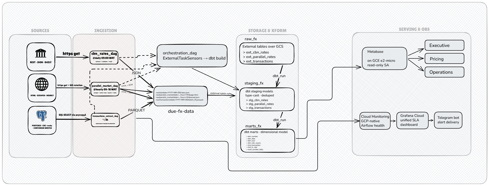

# Due FX Analytics Platform

> End-to-end data platform for a Nigerian remittance startup — ingesting FX rates, modeling a dimensional warehouse, and serving role-specific analytics dashboards to pricing, operations, and executive stakeholders.


---

## The Problem

**Due** is a Nigerian remittance startup processing ~₦3 billion in monthly transaction volume. Today, pricing is done by mirroring the general market rate — ignoring that spreads are largely driven by the parallel (black) market rate, which moves intraday. This lag causes:

- **Suppressed margin** from suboptimal spread management (estimated 3–5% of gross margin)
- **Customer churn** as users switch to competitors with tighter, more responsive pricing
- **Manual bottleneck**: the Director of Pricing sets rates by hand, which can't scale with transaction growth

This platform replaces guesswork with data — delivering a daily-refreshed view of official vs. parallel market rates, corridor-level transaction patterns, and pipeline health.

---

## What Gets Built

A production-grade batch data platform that:

1. **Ingests** FX rates from the CBN (official) and a parallel market aggregator, plus internal transaction data via PostgreSQL CDC
2. **Transforms** raw data into a dimensional warehouse model using dbt on BigQuery
3. **Serves** three role-specific dashboards (Executive, Pricing, Operations) via Metabase
4. **Monitors** data freshness, pipeline health, and alerts via Telegram when SLAs breach

**SLAs:** CBN rates ≤ 24h stale · Parallel market rates ≤ 2h · Transaction data ≤ 2h

---

## Architecture



The platform follows a four-lane flow: source systems → Airflow ingestion DAGs landing data to GCS → BigQuery storage with dbt transformations (orchestrated by a master DAG using ExternalTaskSensors) → Metabase serving and Cloud Monitoring / Grafana / Telegram observability.

See [docs/architecture.md](docs/architecture.md) for component-level detail and architectural decisions.

---

## Tech Stack

| Layer | Technology |
|---|---|
| Orchestration | Apache Airflow |
| Ingestion | Python (requests, BeautifulSoup, psycopg2) |
| Storage | Google Cloud Storage (raw), BigQuery (warehouse) |
| Transformation | dbt (dbt-bigquery) |
| BI / Serving | Metabase |
| Infrastructure | GCP (Compute Engine, Cloud Storage, BigQuery, Secret Manager) |
| Observability | Cloud Monitoring, Grafana Cloud, Telegram alerts |
| CI/CD | GitHub Actions |

---

## Data Sources

| Source | Method | Freshness Target |
|---|---|---|
| Central Bank of Nigeria (CBN) | REST API | ≤ 24 hours |
| Parallel Market Aggregator | HTML scraping | ≤ 2 hours |
| Internal Operational DB | PostgreSQL CDC | ≤ 2 hours |

---

## Repository Structure

```
.
├── docs/               # Project charter, architecture, data model, runbooks
├── airflow/            # DAGs and plugins
├── dbt/                # dbt project (staging + marts)
├── data-generator/     # Postgres transaction simulator
├── infra/              # Terraform (added in later phase)
├── scripts/            # Utility scripts
├── tests/              # Integration and pipeline tests
└── .github/workflows/  # CI/CD pipelines
```

---

## Build Roadmap

This is an 11-day build. Progress is tracked below.

| Day | Focus | Status |
|---|---|---|
| 1 | Repo scaffolding, project charter, architecture design | In progress |
| 2 | Data generator — PostgreSQL transaction simulator | Pending |
| 3 | CBN ingestion pipeline (Airflow DAG) | Pending |
| 4 | Parallel market scraper + rate reconciliation | Pending |
| 5 | GCS raw layer + BigQuery landing zone | Pending |
| 6 | dbt staging models + tests | Pending |
| 7 | dbt mart models (facts + dimensions) | Pending |
| 8 | Metabase dashboards (all 3 personas) | Pending |
| 9 | Observability — freshness alerts, Grafana, Telegram | Pending |
| 10 | CI/CD + full pipeline integration test | Pending |
| 11 | Documentation, runbook, cost audit, final demo | Pending |

---

## Setup

*Full setup instructions are added as each component is built. The platform is not yet runnable end-to-end.*

**Prerequisites (for when it is):**
- Python 3.11+
- Docker (for local Airflow)
- GCP project with BigQuery, GCS, and Secret Manager enabled
- `gcloud` CLI authenticated
- dbt CLI (`dbt-bigquery`)

---

## Cost Target

Infrastructure budget: **< $50 / month** using GCP free tier + minimal chargeable resources. A detailed cost breakdown will be published at project completion.

---

## Project Documentation

| Document | Description |
|---|---|
| [Project Charter](docs/project-charter.md) | Business context, scope, personas, SLAs, success criteria |
| Architecture | *Added at end of Day 1* |
| Data Model | *Added at end of Day 1* |
| Runbook | *Added at end of Day 1* |

---

## License

MIT — see [LICENSE](LICENSE)

---

## Author

**Chinedum Sunday**
Data Engineer · [chinedumsunday5@gmail.com](mailto:chinedumsunday5@gmail.com)
