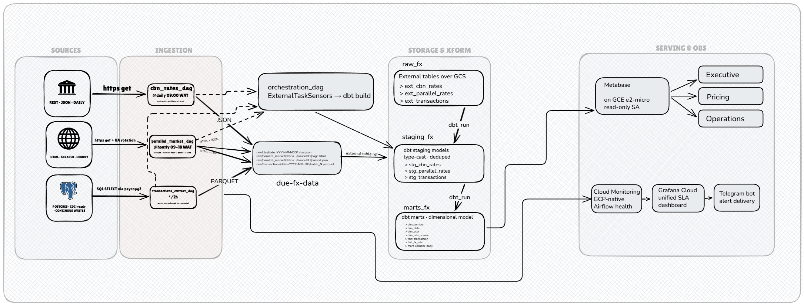

# Architecture — Due FX Analytics Platform

## 1. Overview
The Due FX Analytics Platform is a daily-batch data system for a Nigerian remittance startup, built on Google Cloud Platform under a $50/month budget. it ingests official CBN rates, intraday parallel market data, and internal transaction logs into a centralized BigQuery warehouse. By refreshing parallel market rates every two hours, the platform gives the Director of Pricing, the Head of Operations, and the CEO a single place where they can see how Due's pricing compares to the market - replacing  the daily guesswork they currently rely on.

## 2. Architecture Diagram

*Figure 1: End-to-end data flow showing sources, ingestion DAGs, GCS landing zone, BigQuery storage with dbt transformations orchestrated via ExternalTaskSensors, Metabase serving, and the observability stack.*

---

## 3. Component

### 3.1 Apache Airflow (Orchestration)
**What:** Apache Airflow, the industry standard tool for orchestrating data pipelines, managing the 2hr window automation for parallel market rate, 24hr window for the official rates and also the postgres database. 
**Why this:** Airflow lets me run the three ingestion DAGs on independent schedules, then use ExternalTaskSensors in master orchestration_dag to wait for all three to complete before triggering the dbt task.
**Rejected:** Cron jobs can't handle cross-task dependencies. Each scheduled job would run blindly on its own without any way to wait on the others, which means dbt would sometimes run against incomplete data.

### 3.2 Google Cloud Storage (Raw Landing Zone)
**What:** A staging area for raw data from the three sources: JSON from the CBN API, HTML + JSON (raw + parsed) from the parallel market scraper, and Parquet from the Postgres extractor. 
**Why:** this would help with maintaining the already gotten data, if for any reason there is a change in the source layout, so that way we don't lose any data when there is a failure, if the parallel market site changes its HTML layout, my parser will break but the raw HTML is already saved in GCS, so i can fix the parser and reprocess without re-scraping.
**Rejected:** moving data into directly into bigquery, would work but not the best since we wont have a fall back for when something fails or isn't parsed correctly 

### 3.3 BigQuery (Warehouse)
**What:** BigQuery is a fully managed, serverless and also highly scalable cloud data warehouse made by Google cloud for fast SQL based analysis for large datasets. 
**Why:** BigQuery's free tier (10GB storage, 1TB queries per month) covers the entire $50 budget, if I use partition filters on large queries. it scales fine to the 500k rows/day target without architectural change. 
**Rejected:** Snowflake would also work, but the free trial expires after 30 days, after that the project would stop running. BigQuery's permanent free tier means I can keep this portfolio project live for free.

### 3.4 dbt (Transformation)
**What:** A tool that enables engineers transform data in warehouse using SQL with version control support and more
**Why:** dbt gives me three things i actually need: 
1. version-controlled SQL transformatiosn so i can review changes in PRs.
2. a built-in testing framework so i can assert things like 'fx_rate must be > 0' on every run.
3. auto-generated lineage docs so i can see how marts depend on staging models.
**Rejected:**  an alternative would have been the BigQuery Scheduled Queries but the absence of version control and frameworks for testing, and history tracking is a condition we cannot trade in this pipeline.

### 3.5 Metabase (BI/Serving)
**What:** This would be a self hosted dashboard served to the necessary individuals.
**Why:** Metabase is free, supports BigQuery natively, and lets non-technical users (the CEO) click through pre-built dashboards while letting Dr. Adaeze (Director of Pricing) write her own SQL questions when she needs to dig deeper. That mixed-skill audience is exactly what Metabase is designed for. 
**Rejected:** Tableau would have been another alternative but the cost is a hitch as it crosses the $50 slated budget for the pipeline. 

### 3.6 Operational Postgres (Source)
**What:** A simulated PostgreSQL database modeling Due's operational transaction system. A data generator continuously inserts realistic transactions to mimic a live remittance environment.
**Why:**Pulling from a live operational database via incremental SQL extraction is the most common ingestion pattern in real DE work. Building it here means I can talk fluently about watermarks, idempotency, and clock skew in interviews — and I'll reuse this same database for the CDC project later.
**Rejected:** CSVs would not solve the problem of timing and integrity. 

### 3.7 Observability Stack (Cloud Monitoring + Grafana + Telegram)
**What:** This is a system for monitoring the pipeline on the cloud and getting alerts in times when the conditions require it. 
**Why:** The 15-minute failure detection SLA needs push notifications, not email. Telegram is free, has a simple bot API, and matches the same alerting pattern I used in the MTL News Desk pipeline — so I'm reusing knowledge instead of learning a new tool. Cloud Monitoring is GCP-native (no setup), and Grafana Cloud's free tier stitches everything into one dashboard. 
**Rejected:** Email notifications would be too slow for monitoring this service due to the focus being with the forex market 

---

## 4. Data Flow Walkthrough: Parallel Market Update

1.  **Clock-Trigger:**  EHourly during business hours (09:00–18:00 WAT)". (Hourly comfortably satisfies your ≤2h staleness SLA., Airflow triggers the parallel_market_dag.
2.  **Extract:** The task sends an HTTPS GET to the parallel market aggregator with rotated user-agent headers to reduce blocking risk. On 5xx response or timeout, it retries with exponential backoff up to 3 times before failing the task. 
3.  **Land raw HTML**: The raw HTML is saved to gs://due-fx-data/raw/parallel_market/date=YYYY-MM-DD/hour=HH/page.html. Saving the raw response before parsing means a parser fix later doesn't require re-scraping the source.
4.  **Parse & Convert:** A separate task reads the saved HTML, extracts the rate table, and writes parsed records as JSON back to the same GCS prefix.
5.  **Schema Check:** The parsed data is validated — rate must be a positive float, timestamp must be present. If validation fails, the task fails and triggers an alert.
6.  **Orchestration Sensor:** The orchestration_dag running its ExternalTaskSensor detects that all three ingestion DAGs have completed successfully.
7.  **dbt Build:** `dbt build` runs. It creates a new `stg_parallel_rates` table, casting strings to decimals and removing any duplicates.
8.  **Checking the spread:** dbt joins the parallel rate with the official CBN rate to create the `fact_fx_spread` mart.
9.  **Visual Update:** Metabase’s BigQuery connection refreshes. Dr. Adaeze sees the updated spread and adjusts the corridor pricing accordingly.
10. **Feedback Loop:** If any step exceeds 15 minutes or fails, a Telegram bot pings the team with a link to the specific failing Airflow task log.

---

## 5. Architecture Decision Records (ADRs)

### ADR-001: Two-stage "raw + parse" pattern for scrapers
**Context:** Parallel market sites are unstable. If we parse during extraction and the site changes, we lose the data.
**Decision:** Always land raw HTML in GCS before parsing into JSON or Parquet.
**Consequences:** 
* **High Recovery:** We can fix parsers and "re-ingest" history without re-scraping from the source website.
* **Storage:** Minor increase in GCS costs, handled by a 90-day retention policy.

### ADR-002: External tables for Raw, Native for Staging/Marts
**Context:** We need a balance between cost-effective ingestion and very responsive dashboards 
**Decision:** Keep raw data as BigQuery external tables pointing at GCS; materialize staging and marts as native BigQuery tables. 
**Consequences:** 
*  **Performance:** Executive dashboards load in under 3 seconds because they query optimized native storage with partition pruning.
* **Cost:** No BigQuery storage fees for raw data since it lives in GCS.

### ADR-003: Land full daily snapshot from CBN rather than incremental extraction
**Context:** The CBN exchange-rate source is exposed via GetAllExchangeRates?format=json, an undocumented endpoint that returns the entire rate history (~61,000 records back to 2001) on every call. It accepts no date parameter, so incremental extraction at the source is not possible the API only serves the full dataset.

**Decision:** Land the complete payload as an immutable daily snapshot at raw/cbn/date=YYYY-MM-DD/rates.json, partitioned by the DAG's logical date. Deduplication and "latest rate per currency per day" logic are deferred to the dbt staging layer rather than handled at ingestion.

**Consequences:**

* Each run writes a full point-in-time snapshot, giving a complete audit trail and the ability to detect upstream revisions (central banks do revise historical rates).
* Storage cost is negligible (~10MB/day).
* Re-running a given logical date overwrites the same object, preserving idempotency.
* The tradeoff carrying redundant history in each file — is accepted because it keeps the raw layer a faithful capture of the source and pushes all transformation into dbt, consistent with the project's ELT design.

### ADR-004: Validate after landing, driven by the Celery executor

**Status: Accepted**

**Context:** The pipeline runs on Airflow's CeleryExecutor, where tasks may execute on different workers with no shared local filesystem. The CBN payload is ~10MB — too large to pass between tasks via XCom without bloating the metadata database, and impossible to hand off via local disk across workers.

**Decision:** Structure the DAG as fetch → land → validate, where validate reads the landed object back from GCS rather than receiving the data in memory. Each task retrieves the object path (a small string) via XCom; the actual data lives in GCS.

**Consequences:**

* Validation checks the artifact that actually landed in storage, not an in-memory copy — arguably a stronger guarantee.
* It costs an extra GCS round-trip: validate re-downloads the full file, which is the dominant cost of that task.
* At scale, the preferred pattern is to fetch, validate, and land within a single task — validating the payload in memory before upload and returning only the object path. This DAG keeps the three-task split for clarity and to mirror the extract→land→validate structure in the architecture diagram; the single-task consolidation is noted as the production evolution.

### ADR-005: Parallel market rates sourced from abokidollar JSON API

**Status: Accepted**

Context: The architecture originally specified HTML scraping of a parallel-market aggregator. Evaluation of available sources found: AbokiFx is now a paid service; ngnrates last updated AED in 2020; nairatoday embeds 90 days of history in page JSON but the series ends 2026-02-26 (five months stale) and omits AED; abokiforex.app serves all four corridors in server-rendered HTML but exposes no timestamp and requires selectors scoped around a shared `rate-value` class also used by its CBN section. abokidollar.com/api/rates returns clean JSON with buy and sell rates, ISO currency codes, a `lastUpdated` timestamp, and a 7-day history array per currency, covering all four project corridors (USD, GBP, EUR, AED).

**Decision:** Ingest parallel market rates from the abokidollar JSON API rather than scraping HTML.

**Consequences:**

* Eliminates HTML parsing fragility and the maintenance burden of CSS selectors against a third-party layout.
* `lastUpdated` provides a source-supplied observation time, which the HTML alternatives did not.
* Trade-off: the architecture's three-ingestion-pattern design (REST API, HTML scrape, incremental DB extraction) loses its scraping leg. Accepted because source reliability outweighs pattern variety; HTML scraping remains demonstrable if a future source requires it.
* The payload mixes Type: `"Black Market"` and `Type: "CBN"` records. The CBN records carry unreliable sell rates (WAUA sell of 14 against a buy of 1867.21; JPY sell of 12) and are excluded — official rates come from CBN's own API. Filtering occurs in validation and again in dbt staging.
* The endpoint is undocumented; raw landing in GCS mitigates the risk of an unannounced schema change.

### ADR-006: Daily ingestion cadence matched to source publication, with staleness tolerance

**Status: Accepted**

**Context:** The architecture specified hourly polling between 09:00 and 18:00 WAT, on the assumption that parallel market rates move intraday. Inspection of the source showed a single `lastUpdated` value of approximately 01:10 UTC, a `history` array at daily grain, and identical USD rates across three consecutive days. Hourly polling would produce roughly ten byte-identical objects per day, none of which represent distinct observations.

**Decision:** Schedule the DAG once daily at 02:00 UTC, after the source's ~01:10 UTC publication. The fact grain is one row per currency, per source type, per day.

**Consequences:**

* Object path reverts to `raw/parallel/date=YYYY-MM-DD/rates.json` with no hour partition, matching the CBN DAG's layout.
* Each response includes a rolling 7-day history window, so any single successful run repairs gaps of up to a week. The pipeline is self-healing; no `catchup` and no separate backfill DAG are required for this source.
* Only 7 days of parallel history are available at launch, against 90 days of simulated transactions. Spread metrics are computed over the available overlap and deepen as the pipeline accumulates its own history — the warehouse becomes the system of record for anything beyond the source's window.
* Validation applies a 2-day staleness tolerance rather than requiring same-day freshness. The source publishes irregularly: a 41-hour gap was observed during development, and the initial same-day assertion correctly failed. A tolerance window distinguishes normal publication lag from a genuinely dead feed.

### ADR-007: Interval-scoped incremental extraction without a stored watermark

**status: Accepted**

**Context:** — the transactions table only grows and rows mutate after creation, so full extraction every two hours is wasteful. Three approaches were considered: a stored watermark in an Airflow Variable, querying the destination for its max, or scoping to the run's data interval. The Variable approach carries mutable state outside the data with a failure window where rows can be silently lost; querying the destination requires a warehouse that doesn't exist yet at this stage.

**Decision:** — extraction scoped to a time window derived from the run's logical timestamp: `data_interval_end - LOOKBACK`. `updated_at` is the filter column, not `created_at`, because status transitions mutate rows after creation.

**Consequences:** 
*the good: no external state, retries and re-runs produce identical windows and identical output. The finding: Airflow 3 collapses `data_interval_start` and `data_interval_end` to a single instant under both cron and timedelta schedules in this deployment, so the window is computed explicitly; a single `LOOKBACK` constant drives both the schedule and the subtraction so they cannot drift. The trade-off: a run that never executes leaves its window permanently uncovered, where a max-seen watermark would eventually sweep it up. The evolution path: CDC via Debezium or Datastream when volume justifies the operational cost.

### ADR-008: NDJSON as the raw format for JSON API sources

**Status: Accepted**

**Context:** Both API sources return a JSON array as a single document. BigQuery external tables over JSON require newline-delimited JSON — one complete object per line — and reject enclosing arrays. Alternatives considered: landing each file as a single JSON-typed column and parsing with JSON functions in dbt, or converting to Parquet at ingestion.

**Decision:** Serialize each record individually and join with newlines, landing `.ndjson` files. Parquet remains the format for the tabular transactions source, where it carries its own schema.

**Consequences:**

* External tables read the files directly with autodetected schemas; CBN's rate strings resolve to FLOAT and dates to DATE without explicit casting.
* The change is to serialization, not content — no records are altered, dropped, or reinterpreted — so it remains consistent with the raw-is-faithful principle in ADR-003.
* Validation tasks now parse line-delimited content rather than a single document.
* Files landed before this change were in array format and were removed rather than migrated; the parallel source's rolling 7-day history window makes such data re-fetchable.

### ADR-009: Normalize top-level field names at ingestion for BigQuery compatibility

**Status: Accepted**

**Context:** The parallel market payload uses inconsistent field naming: `"Buy Rate"`, `"Sell Rate"` and `"Currency Name"` are title case with spaces, while lastUpdated is camelCase. BigQuery column identifiers may contain only letters, numbers and underscores, so external table creation failed on the spaced names.

**Decision:** Apply a field-name mapping at ingestion, normalizing all top-level keys to snake_case. Nested fields within the `history` array (`buyRate`, `sellRate`) are already valid identifiers and pass through unchanged.

**Consequences:**

* Column names are uniform across the raw layer, which keeps staging models readable.
* Every downstream consumer of the raw file must use the normalized names; the validation task was updated accordingly. This coupling is the cost of transforming at ingestion.
* Rejected alternatives: declaring an explicit schema with field mapping in the DDL, or landing each record as a single JSON column and extracting in dbt. Both preserve the source names exactly but push complexity into every downstream query.
* Nested and top-level fields now follow different conventions, which staging models should alias consistently when unnesting.

### ADR-010: Separate initial load from incremental extraction

**Status: Accepted**

**Context:** The transactions extraction DAG is scoped to the run's data interval, so it only covers windows from the point it began running. Approximately 29,000 transactions with `updated_at` values spanning 90 days predate the pipeline and would never be extracted. Airflow's native backfill was unsuitable: covering 90 days at a two-hour interval would require roughly 1,080 runs.

**Decision:** A separate one-time DAG (`schedule=None`) performs the initial load, chunked by day — one Parquet file per date partition, named `backfill.parquet` to distinguish it from incremental output. A cutover timestamp bounds the two loads so they do not overlap: the backfill covers `updated_at` before cutover, the incremental DAG everything after.

**Consequences:**

* Date partitions reflect when transactions occurred rather than when they were loaded, preserving partition pruning across history.
* Rows that were part of the initial load and have since been mutated appear twice in the raw layer at different `updated_at` values. This is expected for an append-only raw layer over a mutable source; staging deduplicates on `transaction_id`, keeping the latest `updated_at`.
A related defect was corrected before loading: historical rows carried naive local timestamps written into a `timestamptz` column, placing them an hour ahead of UTC. Affected rows were shifted before the backfill so the dataset is internally consistent.
---

## 6. Out of Scope (and Why That's Acceptable)

* **Real-time Streaming:** All sources update on hour-or-longer cadences, and no business question identified in the charter requires sub-hour freshness. A streaming stack like Kafka + Flink would also blow the $50 budget.
* **ML Forecasting:** A rule-based spread (e.g., parallel rate + fixed margin) is more transparent and reliable for a seed-stage startup than an unproven model. Worth revisiting at Series A. 
* **Row-Level Security:** With only three users, managing complex IAM/RLS for different departments is deferred until the team scales.
* **No multi-region failover**. The platform runs in us-central1 only. A regional outage halts the pipeline. Acceptable at current stage — RTO of 24 hours fits a seed-stage company.

---

## 7. Evolution Path

At 10x transaction volume (~5M rows/day), the watermark-based Postgres extraction becomes the first bottleneck — full incremental scans every two hours start putting pressure on the operational database. The fix is replacing the SQL extractor with a CDC pipeline using Debezium reading the Postgres write-ahead log into Kafka, then sinking into the same BigQuery staging layer. This drops transaction data staleness from 2 hours to sub-minute without hammering the source DB.

At Series A, the platform adds team-scale concerns: deeper data quality checks (Great Expectations or Soda), column-level lineage across tools (OpenLineage), and a semantic layer (Cube or dbt Semantic Layer) once analyst headcount exceeds five — at that point, metric drift across dashboards becomes a real risk. Metabase moves to a managed deployment to handle the larger internal analyst team.
Liquidity/float analytics and true gross-margin are deferred both need sources outside current scope: a treasury/float feed, and per-transaction FX acquisition cost for a real cost basis.